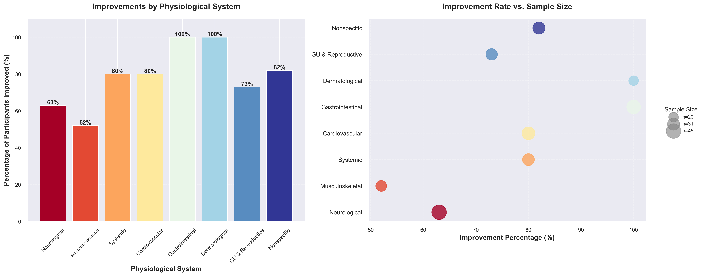

# Psychedelics in Functional Disorders: Data Visualisation

This repository contains code for creating publication-quality visualisations for a scoping review of psychedelics in functional disorders. The visualisations include study type distributions, psychedelic usage timelines, and physiological system improvements.

## Visualisations

### 1. Study Types Distribution

- A bar chart showing the distribution of different study types
- Features vintage-coloured bars with clear value labels
- Includes grid lines for easy value reading
- Uses enhanced typography with bold titles and labels

### 2. Psychedelic Usage Timeline

- A scatter plot showing psychedelic usage across time
- Points sized and coloured by study type
- Includes horizontal reference lines for each psychedelic
- Includes vertical reference lines for years
- Enhanced with vintage colour palette
- Clear legend and axis labels

### 3. Physiological System Improvements

- Dual-panel visualisation showing:
  - Left: Bar chart of improvement percentages by physiological system
  - Right: Bubble chart showing improvement rates vs. sample sizes
- Consistent colour scheme across both panels for easy system tracking
- Bubble sizes represent sample sizes
- Enhanced typography with clear labels
- Includes percentage labels and grid lines for easy reading
- Optimised layout for clear data presentation

## Setup and Installation

### Prerequisites
- Python 3.7 or higher
- pip (Python package installer)

### Installation

1. Clone this repository:
```bash
git clone https://github.com/bmilinkovic/psychedelics-visualisation.git
cd psychedelics-visualisation
```

2. Install required packages:
```bash
pip install -r requirements.txt
```

### Required Packages
The following Python packages are required:
- pandas (>= 2.0.0): Data manipulation and analysis
- matplotlib (>= 3.7.0): Core plotting functionality
- seaborn (>= 0.12.0): Statistical data visualisation
- openpyxl (>= 3.1.0): Excel file support

## Usage

1. Place your data file (Key_results_output_1.2.xlsx) in the project directory
2. Run the visualisation script:
```bash
python visualise_data.py
```

The script will generate three PNG files:
- `study_types.png`
- `psychedelic_timeline.png`
- `system_improvements.png`

## Data Format

The input Excel file should contain the following columns:
- Study: Study identifier
- Study type: Type of study
- Year: Year of study
- Psychedelic: Type of psychedelic used
- Additional columns for system improvements data

## Customisation

The visualisations can be customised by modifying:
- Colour palettes in the `wes_colours` dictionary
- Colour maps for system improvements (using matplotlib's colour maps)
- Figure sizes and dimensions
- Font sizes and styles
- Grid properties
- Output DPI and file format

## Contributing

Feel free to submit issues, fork the repository, and create pull requests for any improvements.

## Licence

This project is licensed under the MIT Licence - see the LICENCE file for details.

## Acknowledgements

- Colour palettes inspired by Wes Anderson films
- Visualisation design based on modern data visualisation best practices
- Seaborn and Matplotlib libraries for powerful Python plotting 